<<<<<<< HEAD

* Nama  : YUNI HIDAYANI
* NIM   : 311910078
* Kelas : 1243B/B311FT-FH
=======
* Nama: Yuni Hidayani
* NIM: 311910078
* Kelas: 1243B
>>>>>>> 036aad151cce3749c574730a9d9123391879b838

Praktikum 1 - PHP Framework CodeIgniter 4

Instalasi CodeIgniter 4

1. Mengunduh CodeIgniter dari website resmi
2. Mengekstrak file ke folder:

   ```
   htdocs/lab11_ci/ci4
   ```
3. Menjalankan project di browser:

   ```
   http://localhost:8080
   ```

Menjalankan Server

Server dijalankan menggunakan perintah berikut:

```
php spark serve
```

---
Konfigurasi Routing

Routing digunakan untuk mengatur URL pada aplikasi.

File: `app/Config/Routes.php`

```php
$routes->get('/', 'Home::index');
$routes->get('/about', 'Page::about');
$routes->get('/contact', 'Page::contact');
$routes->get('/faqs', 'Page::faqs');
$routes->get('/page/tos', 'Page::tos');
```

Pembuatan Controller

Controller digunakan untuk mengatur logika aplikasi.

File: `app/Controllers/Page.php`

```php
public function about()
{
    return view('about', [
        'title' => 'About',
        'content' => 'Ini halaman About'
    ]);
}
```

-Pembuatan View

View digunakan untuk menampilkan halaman web.

Contoh: `app/Views/about.php`

```php
<?= $this->include('template/header'); ?>

<h1><?= $title; ?></h1>
<p><?= $content; ?></p>

<?= $this->include('template/footer'); ?>
```

-Pembuatan Template

Template digunakan agar tampilan konsisten di semua halaman.

# Header (`header.php`)

```php
<link rel="stylesheet" href="<?= base_url('/style.css'); ?>">
```

# Footer (`footer.php`)

```php
<footer>
    <p>© 2026 - Praktikum Web</p>
</footer>
```

-Pembuatan CSS

File CSS digunakan untuk memperindah tampilan.

Lokasi: `public/style.css`

```css
body {
    font-family: Arial;
    background: #f4f4f4;
}
```

---Hasil Tampilan

Halaman yang berhasil dibuat:

* Halaman About
* Halaman Contact
* Halaman FAQ
* Halaman Terms of Services

Kesimpulan

* CodeIgniter 4 menggunakan konsep MVC
* Controller mengatur logika aplikasi
* View mengatur tampilan
* Template membuat tampilan konsisten
* CSS memperindah tampilan web

Link Repository :
https://github.com/username/Lab7Web


# Laporan Praktikum Web 2 – CodeIgniter 4 (CRUD Artikel)

## Deskripsi Praktikum

Pada praktikum ini dilakukan pembuatan aplikasi web sederhana menggunakan framework **CodeIgniter 4** dengan fitur **CRUD (Create, Read, Update, Delete)** pada data artikel.

## Langkah-Langkah Praktikum

### 1. Membuat Database

Membuat database dengan nama `lab_ci4` dan tabel `artikel` dengan field:

* id
* judul
* isi
* slug
* status

---

### 2. Membuat Model

File: `ArtikelModel.php`

Digunakan untuk mengelola data artikel dari database.

---

### 3. Membuat Controller

File: `Artikel.php`

Controller berisi beberapa method:

* `index()` → menampilkan daftar artikel
* `view()` → menampilkan detail artikel
* `admin_index()` → halaman admin
* `add()` → tambah artikel
* `edit()` → edit artikel
* `delete()` → hapus artikel

---

### 4. Membuat View

# Halaman utama
Menampilkan daftar artikel

# Halaman detail
Menampilkan isi artikel berdasarkan slug

# Halaman admin
Menampilkan data artikel dalam bentuk tabel

# Form tambah
Digunakan untuk input artikel baru

# Form edit
Digunakan untuk mengubah data artikel

### 5. Routing

Menambahkan routing di `Routes.php`:

```php
$routes->get('/artikel', 'Artikel::index');
$routes->get('/artikel/(:segment)', 'Artikel::view/$1');

$routes->get('/admin/artikel', 'Artikel::admin_index');
$routes->add('/admin/artikel/add', 'Artikel::add');
$routes->add('/admin/artikel/edit/(:num)', 'Artikel::edit/$1');
$routes->get('/admin/artikel/delete/(:num)', 'Artikel::delete/$1');
```

---

## Implementasi CRUD

###  Create (Tambah Data)
Menambahkan artikel melalui form `form_add.php`

###  Read (Tampil Data)
Menampilkan artikel di:

* halaman utama
* halaman admin

###  Update (Edit Data)
Mengubah data artikel melalui `form_edit.php`

###  Delete (Hapus Data)
Menghapus artikel dari database

##***  Tampilan

Aplikasi menggunakan file CSS (`style.css`) yang disimpan di folder `public` untuk memperindah tampilan.

##  Kesimpulan

Pada praktikum ini berhasil dibuat aplikasi CRUD sederhana menggunakan CodeIgniter 4.
Mahasiswa memahami konsep MVC (Model, View, Controller) serta routing dan integrasi database.

#  Praktikum 3 - View Layout & View Cell (CodeIgniter 4)

JAWABAN DARI PERTANYAAN DAN TUGAS 
1. Manfaat View Layout Dalam Pengembangan Aplikasi :
*Menghindari pengulangan kode
*Tampilan jadi konsisten
*Lebih rapi & mudah maintenance
2. Perbedaan View Cell dan View Biasa
   View Cell : Komponen reusable, Dipanggil dari view, Modular & bisa dipakai ulang. Sedangkan
   View Biasa : Tampilan biasa, Dipanggil controller, Dipanggil controller
3. Improvisasi
Filter kategori:
$model->where('kategori', 'teknologi')->findAll();

Struktur yang Digunakan
1. Layout Utama
File:
app/Views/layout/main.php

Digunakan sebagai template utama yang berisi:
-Header
-Navbar
-Content (renderSection)
-Sidebar
-Footer

2. Menggunakan Section
Contoh pada view:
<?= $this->extend('layout/main') ?>

<?= $this->section('content') ?>
<h1><?= $title; ?></h1>
<p><?= $content; ?></p>
<?= $this->endSection() ?>

3. Menambahkan Sidebar (View Cell)
Pada file layout/main.php:

<section style="display:flex; gap:20px;">
    <div style="flex:3;">
        <?= $this->renderSection('content') ?>
    </div>

    <aside id="sidebar" style="flex:1;">
        <?= view_cell('App\\Cells\\ArtikelTerkini::render') ?>
    </aside>
</section>

4. Membuat View Cell
File:

app/Cells/ArtikelTerkini.php
<?php

namespace App\Cells;

use CodeIgniter\View\Cells\Cell;
use App\Models\ArtikelModel;

class ArtikelTerkini extends Cell
{
    public function render(): string
    {
        $model = new ArtikelModel();
        $artikel = $model->orderBy('id', 'DESC')->findAll(5);

        return view('components/artikel_terkini', [
            'artikel' => $artikel
        ]);
    }
}

5. View untuk Sidebar
File:

app/Views/components/artikel_terkini.php
<h3>Artikel Terkini</h3>
<ul>
<?php foreach ($artikel as $row): ?>
    <li>
        <a href="<?= base_url('/artikel/' . $row['slug']); ?>">
            <?= $row['judul']; ?>
        </a>
    </li>
<?php endforeach; ?>
</ul>

# Praktikum 4 – Authentication (Login System)
Konfigurasi Awal
1. Setup Database

Membuat database:

CREATE DATABASE lab_ci4;
2. Membuat Tabel User
CREATE TABLE user (
    id INT(11) AUTO_INCREMENT,
    username VARCHAR(200),
    useremail VARCHAR(200),
    userpassword VARCHAR(255),
    PRIMARY KEY(id)
);
3. Insert User (dengan password hash)
echo password_hash('admin123', PASSWORD_DEFAULT);

Contoh hasil:

$2y$10$xxxxxxxxxxxxxxxxxxxxxxxx

Lalu insert ke database:

INSERT INTO user (username, useremail, userpassword)
VALUES ('admin', 'admin@email.com', 'HASIL_HASH');

Controller Login

File: app/Controllers/User.php

<?php

namespace App\Controllers;

use App\Models\UserModel;

class User extends BaseController
{
    public function login()
    {
        helper(['form']);

        if ($this->request->getMethod() == 'post') {

            $email = $this->request->getPost('email');
            $password = $this->request->getPost('password');

            $session = session();
            $model = new UserModel();

            $login = $model->where('useremail', $email)->first();

            if ($login) {
                if (password_verify($password, $login['userpassword'])) {

                    $session->set([
                        'user_id' => $login['id'],
                        'user_name' => $login['username'],
                        'user_email' => $login['useremail'],
                        'logged_in' => true
                    ]);

                    return redirect()->to('/admin/artikel');

                } else {
                    $session->setFlashdata("flash_msg", "Password salah.");
                }
            } else {
                $session->setFlashdata("flash_msg", "Email tidak terdaftar.");
            }
        }

        return view('user/login');
    }

    public function logout()
    {
        session()->destroy();
        return redirect()->to('/user/login');
    }
}
 View Login

File: app/Views/user/login.php

<h2>Login</h2>

<?php if(session()->getFlashdata('flash_msg')): ?>
    <p style="color:red"><?= session()->getFlashdata('flash_msg') ?></p>
<?php endif; ?>

<form method="post">
    <p>Email:</p>
    <input type="email" name="email">

    <p>Password:</p>
    <input type="password" name="password">

    <br><br>
    <button type="submit">Login</button>
</form>
 Routing

File: app/Config/Routes.php

$routes->get('/user/login', 'User::login');
$routes->post('/user/login', 'User::login');
$routes->get('/user/logout', 'User::logout');


# Praktikum 5 – Pagination dan Pencarian
=======
### Praktikum 5 - Pagination dan Pencarian

Tujuan
1. Mahasiswa mampu memahami konsep dasar Pagination.
2. Mahasiswa mampu memahami konsep dasar Pencarian.
3. Mahasaswa mampu membuat Paging dan Pencarian menggunakan Framework
Codeigniter 4.

Pada praktikum ini dilakukan pengembangan fitur pagination dan pencarian data pada aplikasi portal berita menggunakan framework CodeIgniter 4. Fitur pagination digunakan untuk membatasi jumlah data yang ditampilkan pada setiap halaman, sedangkan fitur pencarian digunakan untuk mempermudah pengguna dalam mencari artikel berdasarkan kata kunci tertentu.

Langkah Praktikum
1. Membuat Pagination
Pagination digunakan agar data artikel tidak tampil sekaligus dalam satu halaman. Pada praktikum ini digunakan method:
$model->paginate(10);
Artinya setiap halaman menampilkan maksimal 10 data artikel.

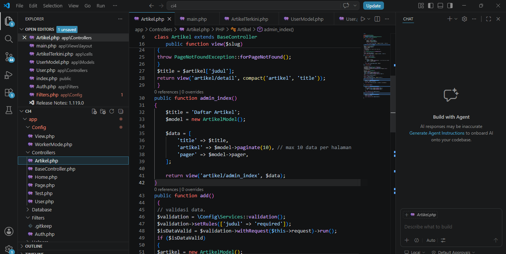

2. Menambahkan Pager
Untuk menampilkan navigasi halaman digunakan:
<?= $pager->links(); ?>
Dengan fitur ini pengguna dapat berpindah halaman data artikel.

Berikut hasilnya :
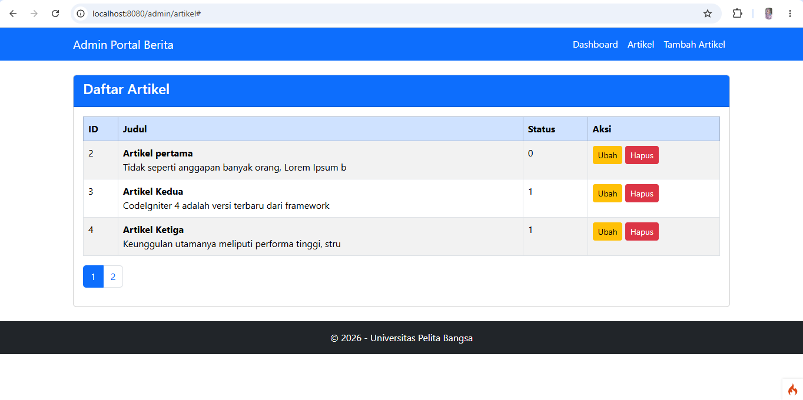

3. Membuat Form Pencarian
Pada halaman admin artikel ditambahkan form pencarian menggunakan input keyword.
Form pencarian:

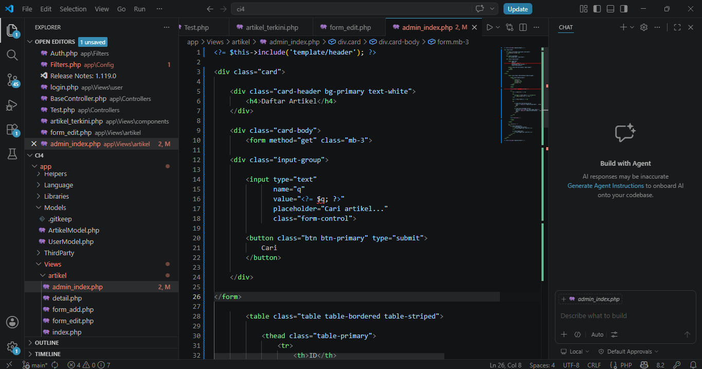


4. Menambahkan Query Pencarian
Pencarian dilakukan menggunakan Query Builder CodeIgniter 4 dengan method like().
$model->like('judul', $q)->paginate(10);
Query tersebut digunakan untuk mencari artikel berdasarkan judul.

Berikut hasilnya :
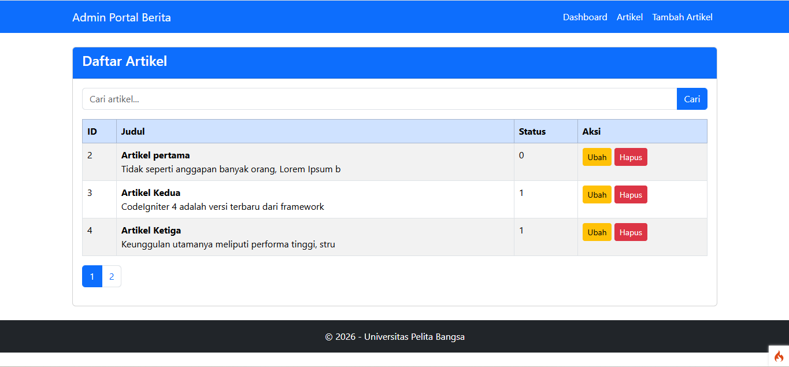


Kesimpulan :
Pada praktikum ini berhasil diterapkan fitur pagination dan pencarian data menggunakan CodeIgniter 4. Dengan adanya pagination, tampilan data menjadi lebih terstruktur dan ringan. Sedangkan fitur pencarian membantu pengguna menemukan artikel dengan lebih cepat dan efisien.

# Praktikum 6: Relasi Tabel dan Query Builder

### Deskripsi Praktikum
Praktikum ini membahas implementasi relasi tabel pada framework CodeIgniter 4 menggunakan Query Builder JOIN. Pada praktikum ini dilakukan pembuatan tabel kategori yang dihubungkan dengan tabel artikel menggunakan foreign key, kemudian data relasi ditampilkan pada halaman admin maupun halaman artikel.

### Tujuan Praktikum
*Memahami konsep relasi tabel pada database.
*Mengimplementasikan foreign key pada MySQL.
*Menggunakan Query Builder JOIN pada CodeIgniter 4.
*Menampilkan data relasi pada halaman web.
*Membuat form tambah dan edit artikel dengan dropdown kategori.

### Langkah Praktikum
1. Membuat Tabel Kategori
Membuat tabel kategori pada database lab_ci4.

Struktur tabel:
id_kategori
nama_kategori
slug_kategori

Query SQL:
CREATE TABLE kategori (
    id_kategori INT(11) AUTO_INCREMENT,
    nama_kategori VARCHAR(100) NOT NULL,
    slug_kategori VARCHAR(100),
    PRIMARY KEY (id_kategori)
);


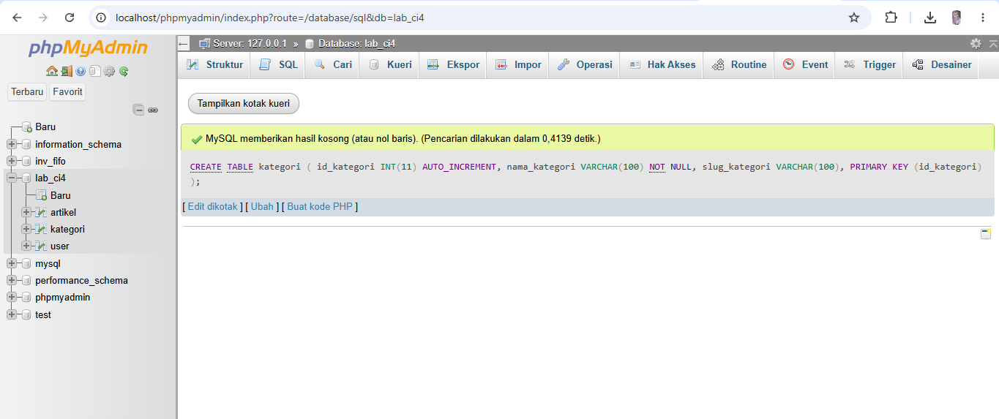


2. Menambahkan Foreign Key
Menambahkan kolom id_kategori pada tabel artikel dan menghubungkannya dengan tabel kategori.

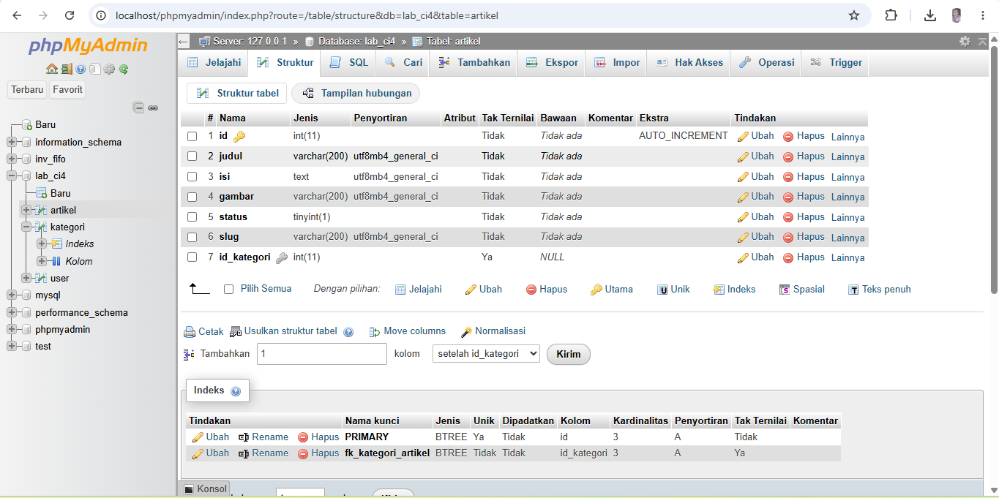

3. Modifikasi Model
Menambahkan method JOIN pada ArtikelModel.php.

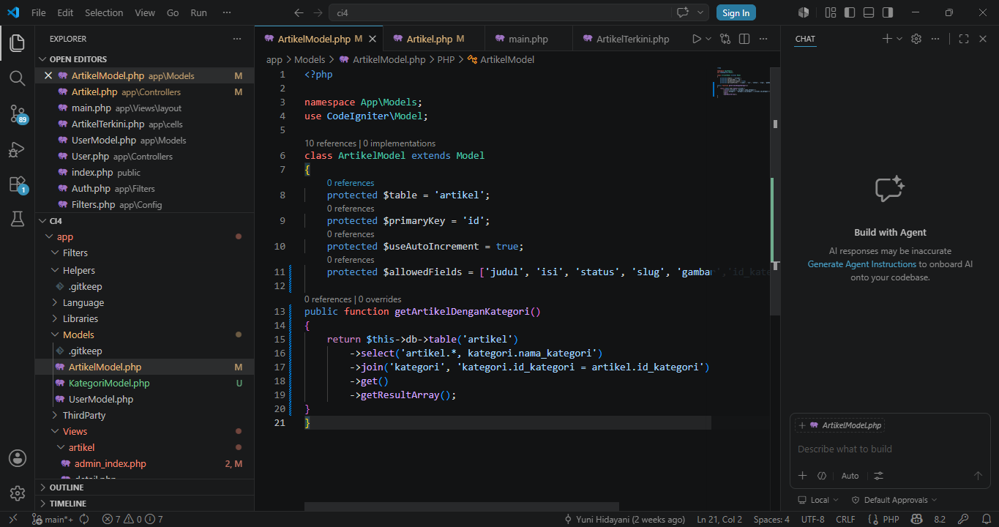

2. Menambahkan Foreign Key
Menambahkan kolom id_kategori pada tabel artikel dan menghubungkannya dengan tabel kategori.

3. Modifikasi Model
Menambahkan method JOIN pada ArtikelModel.php.

public function getArtikel()
{
    return $this->db->table('artikel')
        ->select('artikel.*, kategori.nama_kategori')
        ->join('kategori', 'kategori.id_kategori = artikel.id_kategori')
        ->get()
        ->getResultArray();
}


4. Modifikasi Controller
Mengubah controller agar menggunakan method getArtikel() sehingga data kategori ikut ditampilkan.

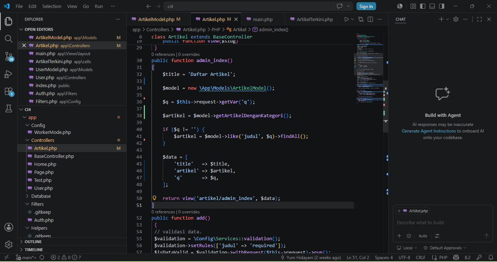


5. Modifikasi View
Menambahkan kolom kategori pada halaman admin dan halaman artikel.
Contoh tampilan:
Artikel Pertama
Kategori: Teknologi

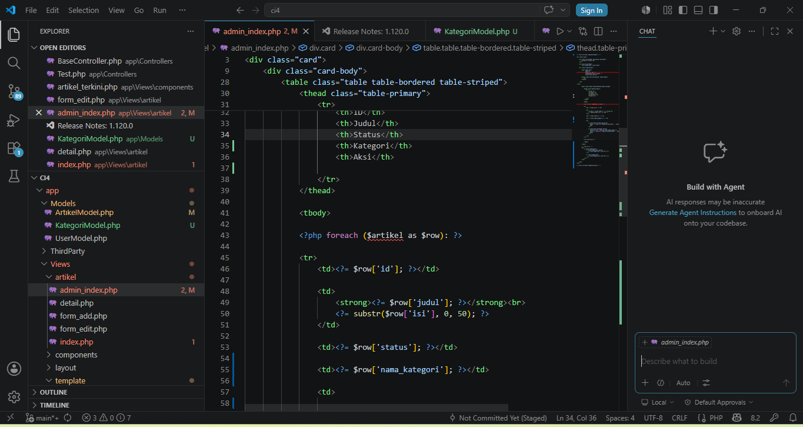


6. Menambahkan Dropdown Kategori
Pada form tambah dan edit artikel ditambahkan dropdown kategori agar pengguna dapat memilih kategori artikel secara langsung.

### Hasil Praktikum
Hasil praktikum menunjukkan bahwa:
Relasi tabel berhasil dibuat.
Query JOIN berhasil dijalankan.
Data kategori dapat ditampilkan pada halaman admin dan halaman artikel.
Form tambah dan edit artikel berhasil menggunakan dropdown kategori.

Berikut gambarnya :

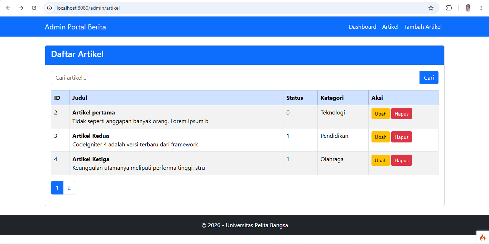

dan

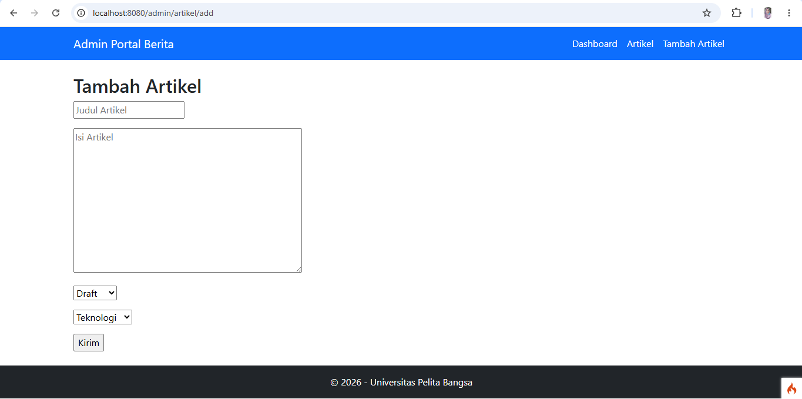


### Kesimpulan
Pada praktikum ini berhasil diterapkan relasi tabel menggunakan foreign key dan Query Builder JOIN pada CodeIgniter 4. Dengan adanya relasi tersebut, data artikel dan kategori dapat saling terhubung sehingga pengelolaan data menjadi lebih terstruktur dan efisien.

# Praktikum 7 — Upload File Gambar

### Deskripsi Praktikum
Pada praktikum ini dilakukan implementasi upload file gambar pada aplikasi portal berita menggunakan framework CodeIgniter 4. Fitur upload digunakan untuk menambahkan gambar pada setiap artikel yang dibuat sehingga tampilan artikel menjadi lebih menarik dan informatif.

### Tujuan
1. Mahasiswa mampu memahami konsep dasar File Upload.
2. Mahasaswa mampu membuat File Upload menggunakan Framework Codeigniter 4.

### Langkah Praktikum
1. Menambahkan Kolom Gambar pada Database
Menambahkan kolom gambar pada tabel artikel untuk menyimpan nama file gambar.
Query SQL:
ALTER TABLE artikel
ADD gambar VARCHAR(255);

2. Modifikasi Controller Artikel
Melakukan perubahan pada method add() di Artikel.php untuk menangani proses upload gambar.
Kode upload file:
$file = $this->request->getFile('gambar');
$file->move(ROOTPATH . 'public/gambar');

Kode penyimpanan nama file:
'gambar' => $file->getName(),

3. Modifikasi Form Tambah Artikel
Menambahkan atribut enctype pada tag form agar dapat mengirim file upload.
<form action="" method="post" enctype="multipart/form-data">
   
4. Menambahkan Input File

Menambahkan field input file pada form tambah artikel.
<p>
    <input type="file" name="gambar">
</p>

4. Membuat Folder Upload
Membuat folder:
public/gambar
Folder ini digunakan untuk menyimpan file gambar yang diupload.

### Hasil Praktikum
Hasil dari praktikum ini yaitu:
Form upload gambar berhasil ditambahkan.
File gambar berhasil diupload ke folder public/gambar.
Nama file gambar berhasil disimpan ke database.
Artikel dapat memiliki gambar sesuai upload pengguna.

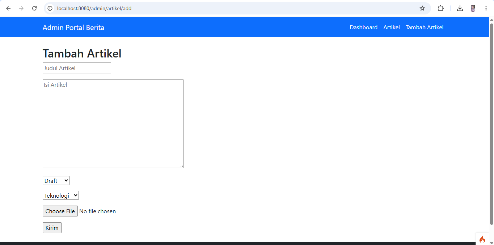


### Kesimpulan
Pada praktikum ini berhasil diterapkan fitur upload file gambar menggunakan CodeIgniter 4. Dengan adanya fitur upload gambar, artikel menjadi lebih menarik dan pengelolaan media pada website dapat dilakukan dengan lebih baik.

# Praktikum 8: AJAX

### Deskripsi Praktikum
Pada praktikum ini dilakukan implementasi AJAX pada aplikasi portal berita menggunakan framework CodeIgniter 4 dan jQuery. AJAX digunakan untuk mengambil data artikel dari server tanpa melakukan reload halaman sehingga proses menampilkan data menjadi lebih cepat dan interaktif.

### Tujuan
1. Memahami konsep AJAX dan cara kerjanya.
2. Mampu mengimplementasikan AJAX pada aplikasi web dengan CodeIgniter 4.
3. Melatih kemampuan problem solving dan debugging.

### Langkah Praktikum
1. Menyiapkan jQuery
Membuat folder:
public/assets/js
Kemudian menambahkan file:
jquery-4.0.0.min.js
File jQuery digunakan untuk menjalankan AJAX pada halaman web.
2. Membuat AjaxController
Membuat file controller:
app/Controllers/AjaxController.php
Controller digunakan untuk menampilkan halaman AJAX dan mengirim data artikel dalam format JSON.
Contoh method:
public function getData()
{
    $model = new ArtikelModel();

    $data = $model->findAll();

    return $this->response->setJSON($data);
}
3. Menambahkan Route AJAX
Menambahkan route pada file:
app/Config/Routes.php
Kode route:
$routes->get('/ajax', 'AjaxController::index');
$routes->get('/ajax/getData', 'AjaxController::getData');
4. Membuat View AJAX
Membuat file view:
app/Views/ajax/index.php
View digunakan untuk menampilkan tabel artikel yang datanya diambil menggunakan AJAX.


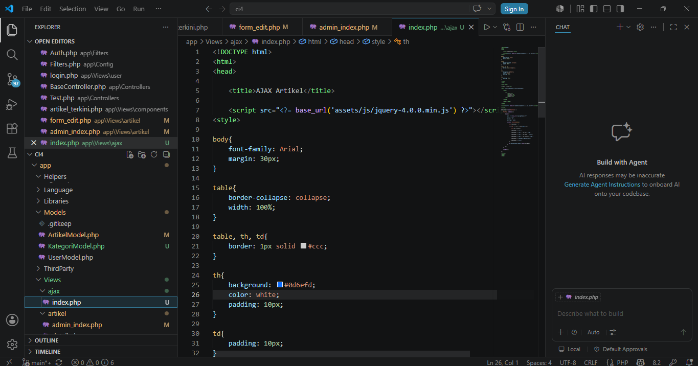

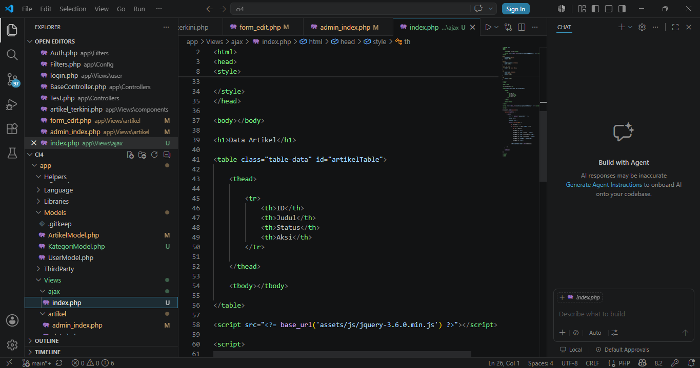

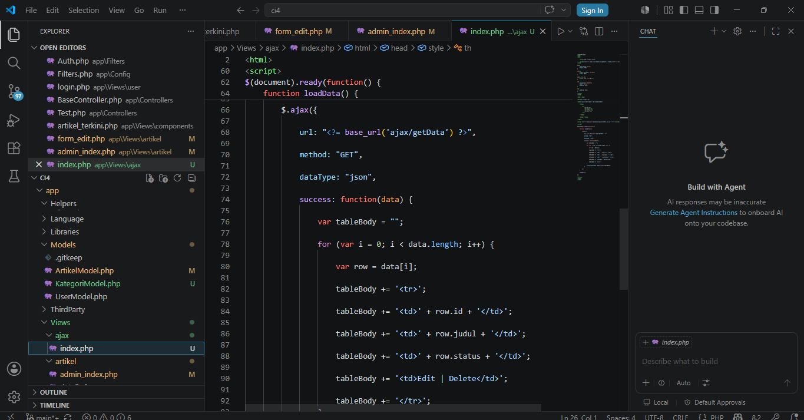


5. Membuat AJAX Request
Menggunakan jQuery AJAX untuk mengambil data artikel dari server.
Contoh kode:
$.ajax({

    url: "<?= base_url('ajax/getData') ?>",git add .

    method: "GET",

    dataType: "json",

    success: function(data) {

        console.log(data);
    }

});
6. Menampilkan Data ke Tabel
Data JSON yang diterima kemudian ditampilkan ke dalam tabel HTML menggunakan JavaScript dan jQuery.

### Hasil Praktikum
Hasil dari praktikum ini yaitu:
* Data artikel berhasil diambil menggunakan AJAX.
* Data ditampilkan tanpa reload halaman.
* JSON response berhasil diproses menggunakan jQuery.
* Halaman menjadi lebih interaktif dan dinamis.

Berikut tampilannya :

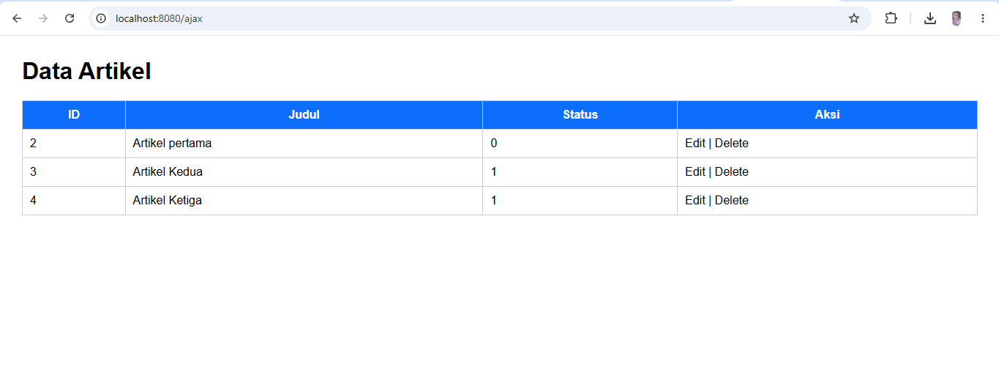


### Kesimpulan
Pada praktikum ini berhasil diterapkan AJAX menggunakan jQuery dan CodeIgniter 4. Dengan AJAX, proses pengambilan data dapat dilakukan tanpa reload halaman sehingga aplikasi menjadi lebih cepat dan responsif.

# Praktikum 9: Implementasi AJAX Pagination dan Search

## Deskripsi Praktikum
Pada praktikum ini dilakukan implementasi AJAX pada aplikasi portal berita menggunakan framework CodeIgniter 4 dan jQuery. Fitur AJAX digunakan untuk melakukan pencarian (search) dan pagination tanpa melakukan reload halaman, sehingga data dapat ditampilkan secara lebih cepat dan interaktif.

## Tujuan Praktikum

1. Memahami konsep AJAX pada CodeIgniter 4.
2. Mengimplementasikan fitur pencarian data secara realtime.
3. Mengimplementasikan pagination menggunakan AJAX.
4. Membuat aplikasi menjadi lebih responsif dan interaktif.


## Fitur yang Dibuat

### 1. AJAX Search
Fitur pencarian artikel dilakukan tanpa reload halaman. Data yang ditampilkan akan berubah sesuai kata kunci yang dimasukkan pengguna.

### 2. AJAX Pagination
Perpindahan halaman data artikel dilakukan secara asynchronous sehingga halaman tidak perlu dimuat ulang.

## Langkah Praktikum

### 1. Persiapan
- Menjalankan MySQL Server.
- Membuka database `lab_ci4`.
- Memastikan tabel `artikel` dan `kategori` sudah tersedia.
- Menambahkan library jQuery.

### 2. Modifikasi Controller Artikel
Method `admin_index()` dimodifikasi agar dapat mengembalikan data dalam format JSON ketika request berasal dari AJAX.


### 3. Modifikasi View
View `admin_index.php` diubah dengan menambahkan:

- Form pencarian.
- Filter kategori.
- Container data artikel.
- Container pagination.
- Script AJAX menggunakan jQuery.

## Screenshot Hasil Praktikum

### Halaman Data Artikel
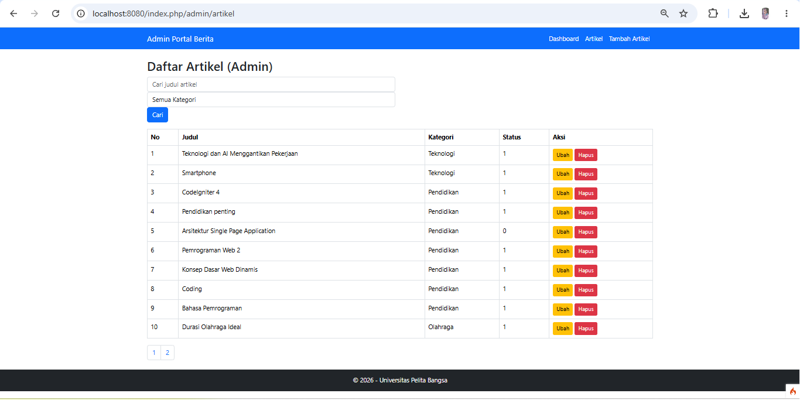

### Pencarian Artikel
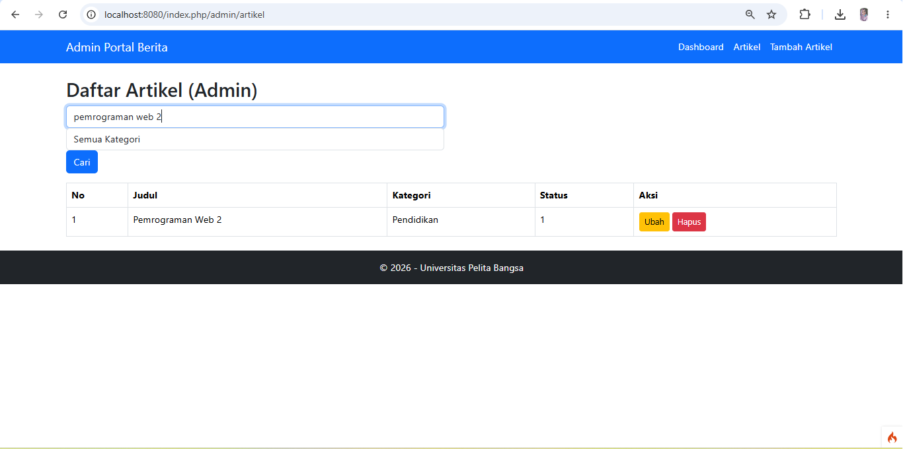

## Hasil Praktikum

Pada praktikum ini berhasil diterapkan AJAX menggunakan jQuery dan CodeIgniter 4. Dengan AJAX, proses pencarian dan pagination dapat dilakukan tanpa reload halaman sehingga aplikasi menjadi lebih cepat, responsif, dan memberikan pengalaman pengguna yang lebih baik.


## Kesimpulan

Implementasi AJAX Pagination dan Search berhasil dilakukan menggunakan CodeIgniter 4 dan jQuery. Penggunaan AJAX mampu meningkatkan performa aplikasi serta mempermudah pengguna dalam melakukan pencarian dan perpindahan halaman data artikel secara dinamis.

# Praktikum 10: API

## Deskripsi Praktikum
Pada praktikum ini dilakukan pembuatan REST API menggunakan Framework CodeIgniter 4. REST API digunakan sebagai perantara pertukaran data antara server dan client dengan format data JSON. Pada praktikum ini dibuat API untuk mengelola data artikel yang meliputi proses menampilkan, menambahkan, mengubah, dan menghapus data artikel.


## Tujuan Praktikum

1. Memahami konsep dasar API.
2. Memahami konsep dasar RESTFull API.
3. Membuat API menggunakan Framework CodeIgniter 4.


## Tools yang Digunakan

- PHP 8
- CodeIgniter 4
- MySQL
- XAMPP
- Visual Studio Code
- Postman

## Langkah Praktikum

### 1. Persiapan
- Membuka project `lab11_ci`.
- Menjalankan Apache dan MySQL pada XAMPP.
- Menggunakan database `lab_ci4`.
- Mengunduh dan menginstal aplikasi Postman sebagai REST Client.

### 2. Membuat REST Controller

Membuat file `Post.php` pada folder:

```text
app/Controllers/Post.php
```

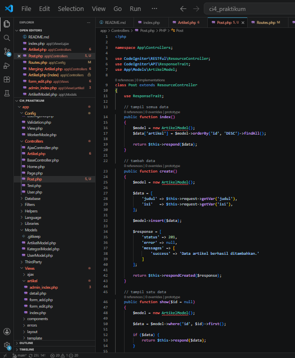

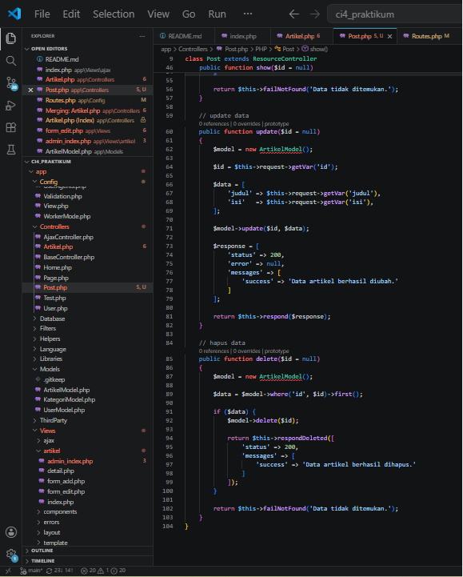

Controller ini berisi method:

- `index()` → menampilkan seluruh data artikel.
- `show()` → menampilkan data berdasarkan ID.
- `create()` → menambahkan data baru.
- `update()` → mengubah data artikel.
- `delete()` → menghapus data artikel.


### 3. Membuat Routing REST API

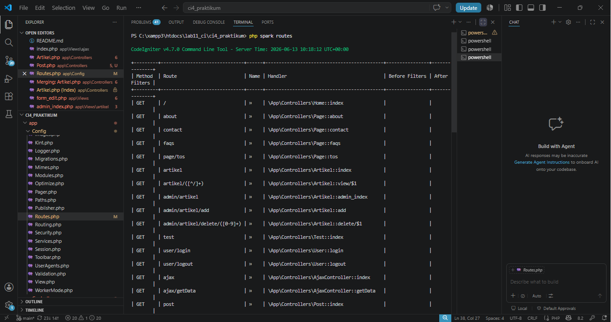

Untuk melihat daftar route:

```bash
php spark routes
```

### 4. Pengujian REST API Menggunakan Postman

#### Menampilkan Semua Data

Pilih method GET dan masukkan URL berikut:
http://localhost:8080/post
Lalu, klik Send. Maka berhasil menampilkan semua data artikel dari database, dan pengujian
berhasil.

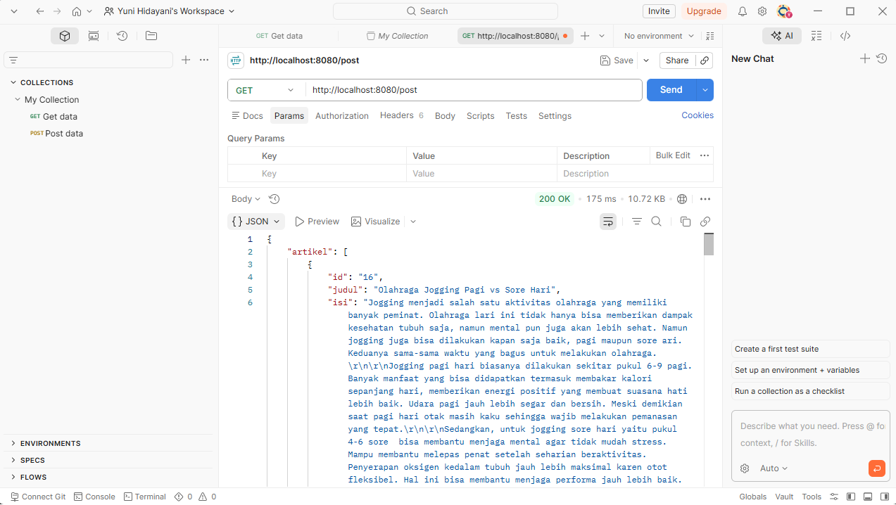

#### Menampilkan Data Spesifik

Masih menggunakan method GET, hanya perlu menambahkan ID artikel di belakang URL
seperti ini:
http://localhost:8080/post/3

Selanjutnya, klik Send. Request tersebut akan menampilkan data artikel yang memiliki ID
nomor 3 di database.

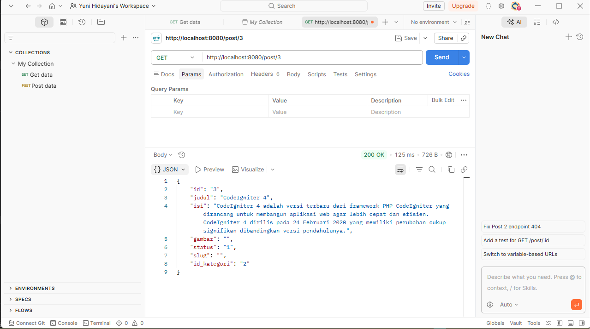

#### Menambahkan Data

Menggunakan method POST untuk menambahkan data baru ke database.
Kemudian, masukkan URL berikut:
http://localhost:8080/post
Pilih tab Body, lalu pilih x-www-form-uriencoded. Masukkan atribut tabel pada kolom KEY
dan nilai data baru di kolom VALUE. Jangan lupa, klik Send.

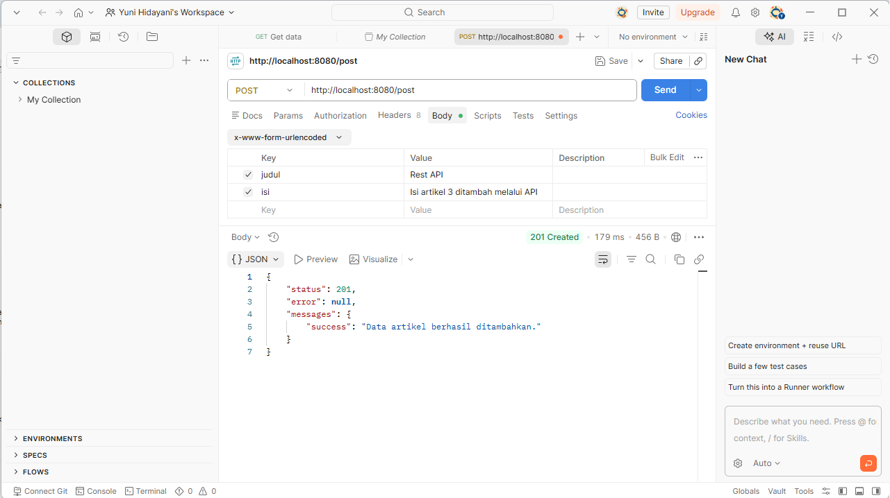

#### Mengubah Data

Untuk mengubah data, silakan ganti method menjadi PUT. Kemudian, masukkan URL artikel
yang ingin diubah. Misalnya, ingin mengubah data artikel dengan ID nomor 3, maka masukkan
URL berikut:
http://localhost:8080/post/3
Selanjutnya, pilih tab Body. Kemudian, pilih x-www-form-uriencoded. Masukkan nama
atribut tabel pada kolom KEY dan nilai data yang baru pada kolom VALUE. Kalau sudah,
klik Send.

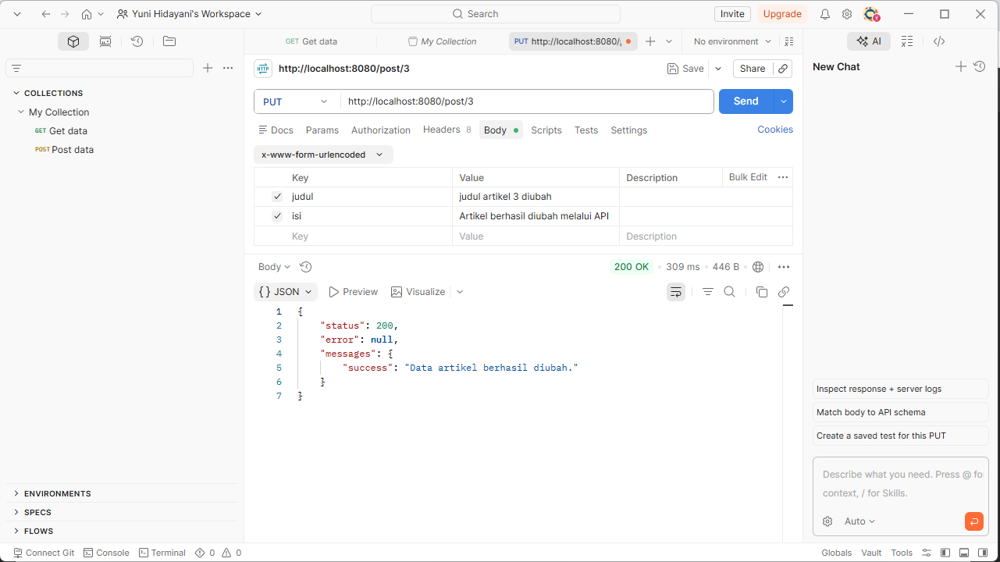

#### Menghapus Data

Pilih method DELETE untuk menghapus data. Lalu, masukkan URL spesifik data mana yang
ingin di hapus. Misalnya, ingin menghapus data nomor 16, maka URL-nya seperti ini:
http://localhost:8080/post/16
Langsung saja klik Send, maka akan mendapatkan pesan bahwa data telah berhasil dihapus dari
database.


## Hasil Praktikum

Pada praktikum ini berhasil dibuat REST API menggunakan Framework CodeIgniter 4. API yang dibuat mampu melakukan operasi CRUD terhadap data artikel melalui HTTP Method GET, POST, PUT, dan DELETE. Seluruh data yang dikirim dan diterima menggunakan format JSON sehingga mudah diintegrasikan dengan aplikasi lain.


## Kesimpulan

Praktikum ini berhasil mengimplementasikan REST API pada CodeIgniter 4 dengan memanfaatkan `ResourceController`. Dengan adanya REST API, pertukaran data antara server dan client menjadi lebih mudah, cepat, dan dapat digunakan untuk integrasi dengan aplikasi frontend seperti VueJS.


# Praktikum 11: VueJS

## Deskripsi Praktikum
Pada praktikum ini dilakukan implementasi framework VueJS 3 sebagai frontend yang terhubung dengan REST API CodeIgniter 4 yang telah dibuat pada praktikum sebelumnya. VueJS digunakan untuk menampilkan data artikel serta melakukan operasi CRUD (Create, Read, Update, Delete) secara dinamis menggunakan Axios.


## Tujuan Praktikum

1. Memahami konsep dasar API.
2. Memahami konsep dasar Framework VueJS.
3. Membuat frontend API menggunakan Framework VueJS 3.


## Tools yang Digunakan

- Visual Studio Code
- VueJS 3 (CDN)
- Axios (CDN)
- CodeIgniter 4 REST API
- XAMPP
- Google Chrome

## Langkah Praktikum

### 1. Membuat Project VueJS

Membuat folder:

```text
htdocs/lab8_vuejs
```

Kemudian membuat struktur folder:

```text
assets/css
assets/js
```

---

### 2. Menambahkan Library VueJS dan Axios

```html
<script src="https://unpkg.com/vue@3/dist/vue.global.js"></script>
<script src="https://unpkg.com/axios/dist/axios.min.js"></script>
```

---

### 3. Menampilkan Data Artikel dari REST API

Menentukan endpoint API:

```javascript
const apiUrl = 'http://localhost:8080';
```

Mengambil data artikel menggunakan Axios:

```javascript
axios.get(apiUrl + '/post')
```

Data artikel kemudian ditampilkan menggunakan:

```html
<tr v-for="(row,index) in artikel">
```

---

### 4. Membuat Fitur Tambah Data

Menambahkan tombol:

```html
<button @click="tambah">
    Tambah Data
</button>
```

Kemudian membuat modal form untuk mengisi:

- Judul
- Isi Artikel
- Status

---

### 5. Membuat Fitur Edit Data

Fungsi edit:

```javascript
edit(data)
```

Fungsi ini digunakan untuk menampilkan data yang dipilih ke dalam form kemudian menyimpan perubahan menggunakan:

```javascript
axios.put()
```

---

### 6. Membuat Fitur Hapus Data

Fungsi hapus:

```javascript
hapus(index,id)
```

Menghapus data menggunakan:

```javascript
axios.delete()
```

---

### 7. Membuat CSS Tampilan

Menambahkan style untuk:

- Tabel artikel
- Tombol
- Modal form
- Input dan textarea
- Tampilan popup tambah dan edit data

---

## Hasil Praktikum

Pada praktikum ini berhasil dibuat aplikasi frontend menggunakan VueJS yang terhubung dengan REST API CodeIgniter 4. Aplikasi mampu:

- Menampilkan data artikel.
- Menambahkan data artikel.
- Mengubah data artikel.
- Menghapus data artikel.
- Menampilkan form secara dinamis tanpa reload halaman.

## Screenshot Praktikum

### Menampilkan Data Artikel
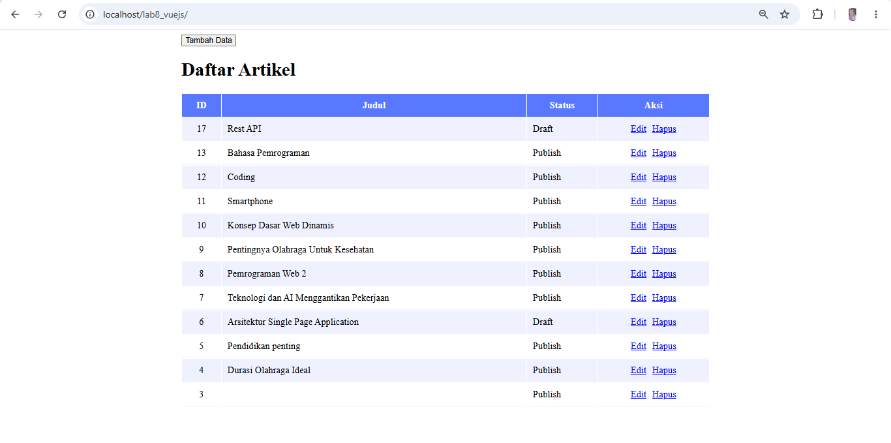

### Tambah Data Artikel
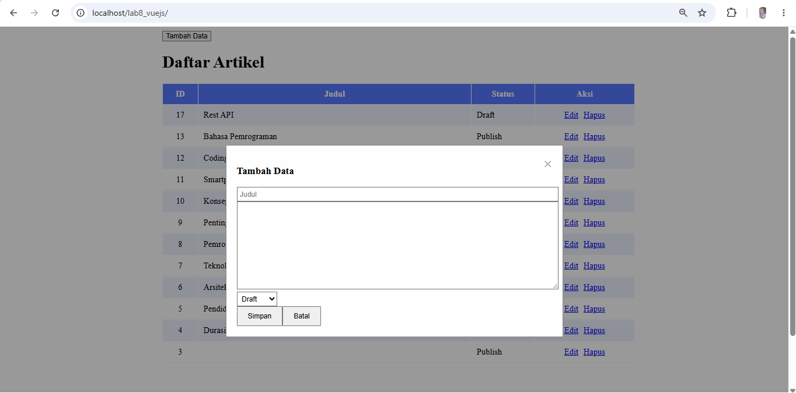


## Kesimpulan

Praktikum ini berhasil mengimplementasikan framework VueJS sebagai frontend yang terintegrasi dengan REST API CodeIgniter 4 menggunakan Axios. Dengan VueJS, proses CRUD dapat dilakukan secara dinamis tanpa melakukan reload halaman sehingga aplikasi menjadi lebih interaktif dan responsif.


# Praktikum	12:	VueJS	Komponen	dan	Routing	(Single	Page	
Application)

# Deskripsi Praktikum
Pada praktikum ini dilakukan pengembangan aplikasi VueJS menjadi Single Page Application (SPA) menggunakan Vue Router. Dengan konsep SPA, perpindahan halaman dapat dilakukan tanpa me-reload browser sehingga aplikasi menjadi lebih cepat dan interaktif.

Pada praktikum ini dibuat beberapa halaman, yaitu Beranda, Kelola Artikel, dan About yang saling terhubung menggunakan Vue Router.

## Tujuan Praktikum

1. Memahami konsep Single Page Application (SPA).
2. Memahami penggunaan Vue Router pada VueJS.
3. Membuat navigasi halaman tanpa reload browser.
4. Membuat komponen halaman menggunakan VueJS.

## Tools yang Digunakan
- Visual Studio Code
- VueJS 3
- Vue Router 4
- Axios
- Google Chrome
- XAMPP

### 1. Menambahkan Library Vue Router

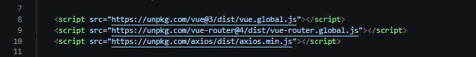

### 2. Membuat Komponen Home

Membuat file baru bernama Home.js untuk menampilkan halaman beranda/selamat datang.

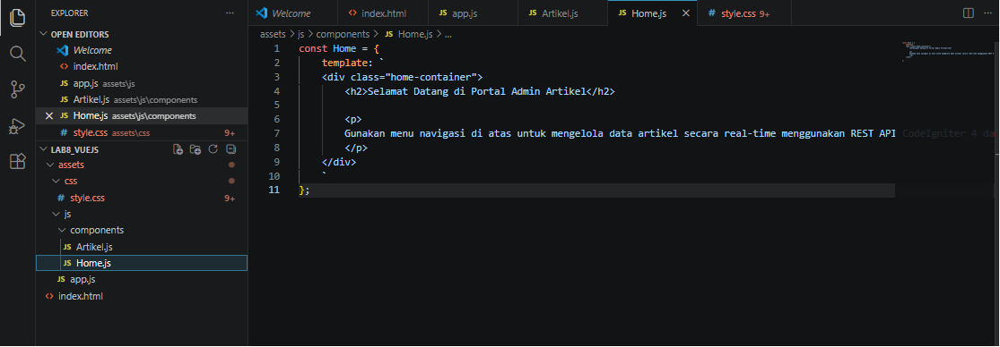

### 3. Membuat Komponen Artikel
Komponen ini digunakan untuk mengelola data artikel yang terhubung dengan REST API.

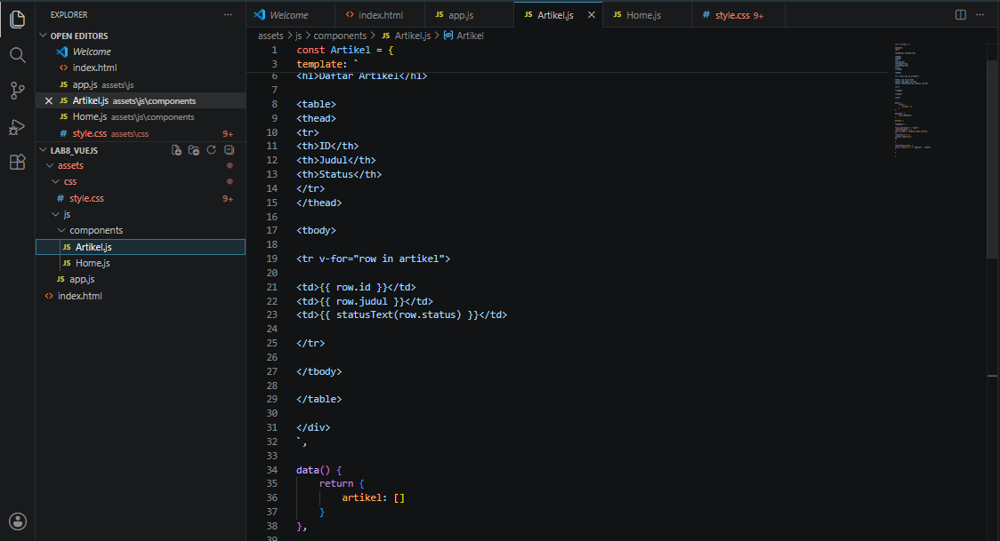

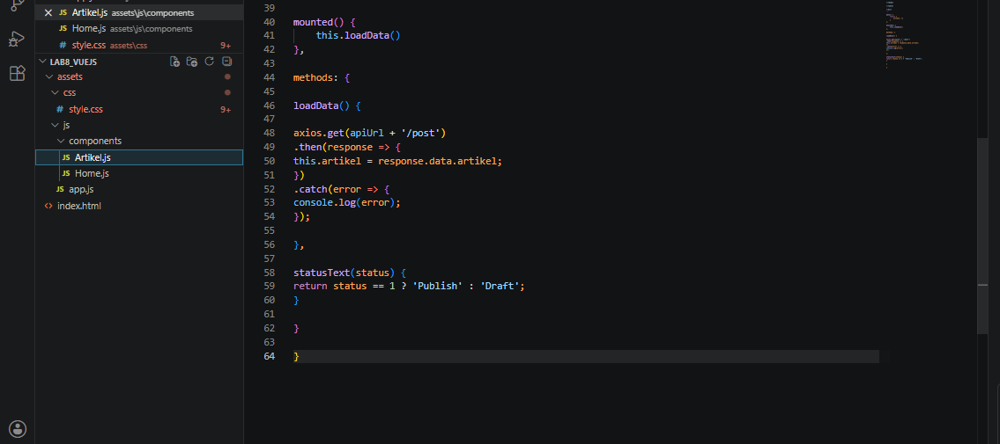

### 4. Membuat Komponen About
Halaman About berisi:

- Nama
- NIM
- Kelas
- Mata Kuliah
- Foto Profil

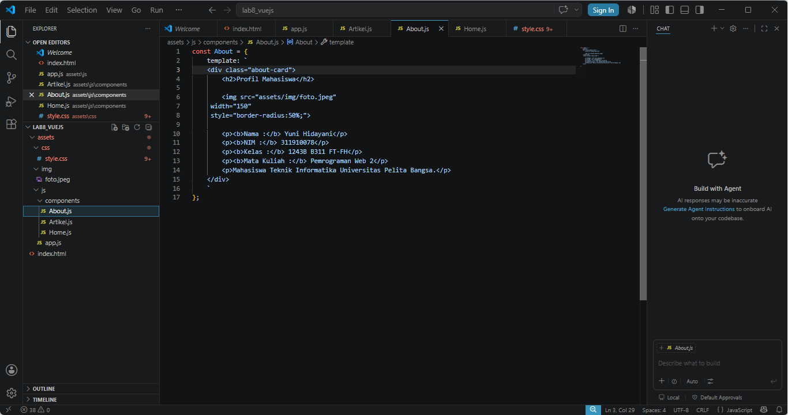

### 5. Membuat Routing

Pada file:

```text
assets/js/app.js
```

Menambahkan route:

```javascript
const routes = [
{
path: '/',
component: Home
},
{
path: '/artikel',
component: Artikel
},
{
path: '/about',
component: About
}
]

### 6. Membuat Menu Navigasi

```html
<nav>
<router-link to="/">Beranda</router-link>
<router-link to="/artikel">Kelola Artikel</router-link>
<router-link to="/about">About</router-link>
</nav>
```

## Hasil Praktikum

Pada praktikum ini berhasil dibuat aplikasi Single Page Application (SPA) menggunakan VueJS dan Vue Router. Pengguna dapat berpindah halaman antara Beranda, Kelola Artikel, dan About tanpa melakukan reload browser.

## Screenshot Praktikum

### Tampilan Beranda
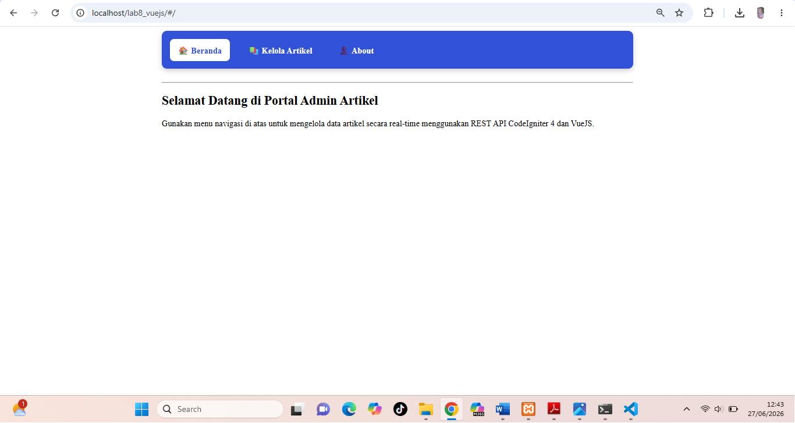

### Halaman Kelola Artikel
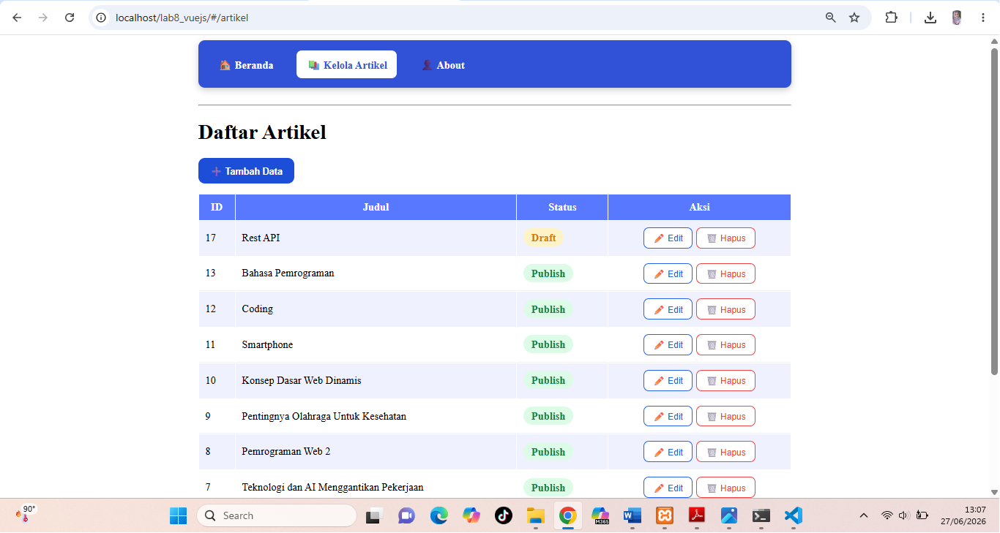

### Halaman About
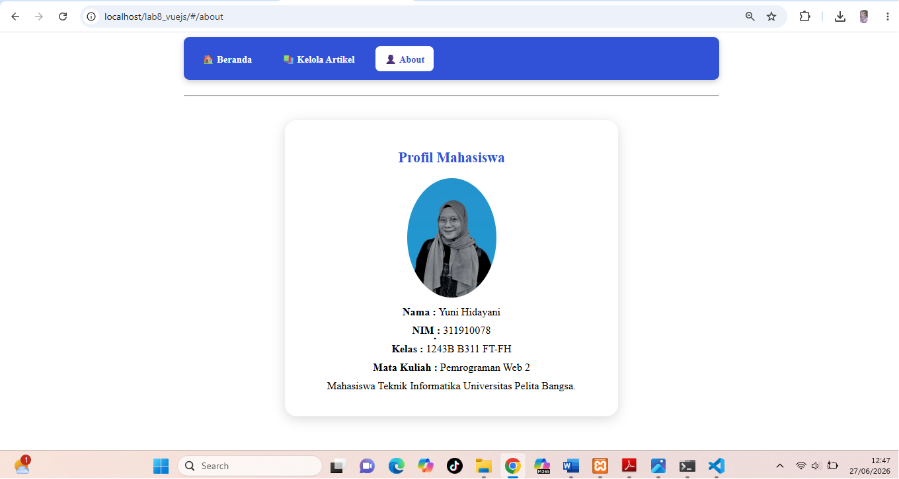

## Kesimpulan

Pada praktikum ini berhasil diterapkan konsep Single Page Application (SPA) menggunakan VueJS dan Vue Router. Dengan menggunakan router, proses perpindahan halaman menjadi lebih cepat karena browser tidak perlu melakukan reload halaman. Selain itu, aplikasi menjadi lebih interaktif dan mudah dikembangkan dengan pendekatan component-based architecture.
